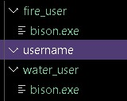

<!-- ABOUT THE PROJECT -->
## About The P2P Network

This is a basic implementation of a P2P network. The instructions to run this network are very simple. To run the network follow the given steps:

1. Run the `manager.py` file using the following command:
```
python manager.py --host localhost --port 12000 --max 20
```
**host**: Host where the manager will run. (*default* = localhost) <br>
**port**: Port where the manager will run. (*default* = 12000) <br>
**max**: Maximum number of peers connection (*default* = 20) <br>


2. Now to run the `peer.py` file open a new terminal and run:
```
python peer.py --manager_host localhost --manager_port 12000 --host localhost --max 20
```
**manager_host**: Host where the manager is running. (*default* = localhost) <br>
**manager_port**: Port where the manager is running. (*default* = 12000) <br>
**host**: Port where the peer will run. (*default* = localhost) <br>
**max**: Maximum number of peers connection (*default* = 20) <br>


3. In the `peer.py` terminal you should be prompted to enter your unique `port number` and `username`. Once that is done a folder will be created with the entered username. As shown below:
 <br>
*Terminal of peer* <br>
 <br>
*Folder created for the peer* <br>


4. In the `manager.py` you can see the table containing the currently active peers.<br>
 <br>
*Table showing currently active peers* <br>


5. Next you can open more terminals and run more `peer.py` files as shown above with unique usernames. The `manager.py ` terminal will look like this: <br>

 <br>
*Table showing currently multiple active peers* <br>


## Transferring files

1. Copy the initial files for every peer and put them  inside the corresponsing peer's folder. <br>
 <br>
*bison.exe in fire_user and water_user* <br>

2. Now in the terminal of the other peer, fetch that file <br>
 <br>
*bison.exe getting fetched parallely in chunks* <br>

3. Now if you look at the other peer's folder, you will see *bison.exe* <br>
 <br>
*bison.exe in the other peer* <br>

4. You can press `Q` in a peer to quit.